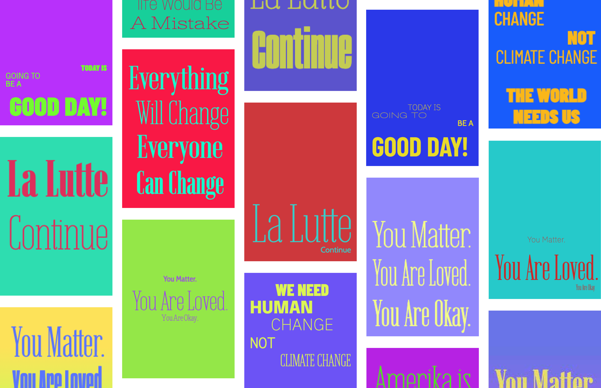

# Evolutionary Poster Composer

Evolutionary Poster Composer **(Evo-poster)** is a computational design approach that explores Evolutionary Computation for the generation of poster designs based on user-provided input (both imagery and text).


## Table of Contents

1. [About](#about)
3. [Getting Started](#getting-started)
    - [Prerequisites](#prerequisites)
    - [Installation](#installation)
    - [Usage](#usage)
    - [Additional Commands](#additional-commands)
    - [Customise Configuration](#customise-configuration)
4. [Contributing](#contributing)
   - [Bug Reports and Feature Requests](#bug-reports-and-feature-requests)
   - [Code Contributions](#code-contributions)
5. [Papers and Documentation](#papers-and-documentation)
6. [Acknowledgments](#acknowledgments)
7. [License](#license)

## About

**Evo-poster** approach takes inspiration from the highly algorithmic processes of letterpress design in [nineteenth-century print houses](https://en.wikipedia.org/wiki/Letterpress_printing). During this era, typographers, in collaboration with clients, selected and composed typography, ornaments, and wood-engraved illustrations to fill a matrix. Design choices were very pragmatic, with condensed typefaces for lengthy sentences and extended typefaces for shorter ones. Important content was highlighted using bigger and bolder typefaces.

In this version of **evo-poster** `(3.0.1)`, our approach considers aesthetic and semantic objectives alongside legibility constraints. The fitness of an individual is determined using a hardwired fitness assignment scheme strategy. We explore two strategies for managing constrained evolution, including the utilisation of stochastic ranking selection. Users can define the search space of the Genetic Algorithm, controlling the visual variation in evolved outputs. Furthermore, users can customise the evolutionary and evaluation processes through a dedicated interface by adjusting the system parameters.
The evaluation metrics consist of the evaluation of designs in terms of their legibility, aesthetic features, and coverage of content semantics. **Legibility** metrics determine whether all text content is adequately displayed and readable within the design, including the evaluation of *text legibility* and *grid appropriateness*. **Aesthetic** metrics assess the visual quality of the designs, examining aspects like *alignment,* *balance,* *justification,* *regularity,* *typeface pairing,* and *negative space fraction.* **Semantic** metrics focus on assessing how the composed text effectively conveys the semantic meaning of the content in terms of *layout,* *visuals,* and *typography*.

In this work, we introduce an emotion recognition Nature Language Processing method, combining lexicon-based and Machine Learning techniques. This method facilitates the identification of emotionally significant parts of input texts, dividing them into sentences. Moreover, users can visually characterise each emotion according to their preferences, incorporating this information into the design process.

Both metrics and emotion recognition methods are developed as stand-alone modules (see [src/@evoposter](/src/@evoposter)). 



The development of this work follows an [agile science methodology](https://arxiv.org/abs/2104.12545), structured around potential [user cases and scenarios]((https://github.com/sergiomrebelo/evo-poster/wiki/Users-Stories-and-Scenarios)). In summary, these users' stories and scenarios unveil that this system can present two main challenges: visual exploration and discovery; and automation. 
We observed that since the system can identify the most emotionally significant parts of a given text, it can be also used as a casual visualization tool.

## Getting Started
Follow these steps to get the project up and running on your local machine.

### Prerequisites
Make sure you have installed [Node.js](https://nodejs.org/) (version 21.6.0 or higher) and [npm](https://www.npmjs.com/) on your machine.

This system uses the [IBM Watson Language Translator](https://www.ibm.com/watson/services/language-translator/) and [Merriam-Webster dictionary](https://www.merriam-webster.com/) APIs. To use these APIs, you must create an account and get the API keys.

### Installation
Clone the repository and install dependencies
```bash
   git clone https://github.com/sergiomrebelo/evo-poster.git
   cd evo-poster
   npm install
   ```

### Usage
1. To run the application, use the following command:
   ```bash
   npm start
   ```
2. Open your browser and go to http://localhost:8000/
3. Upload the input image and text
4. Click on the "Next" button
5. Setup the system parameters, and, in the end, it will start the evolutionary process

### Additional Commands
1. Run the server in development mode:
   ```
   npm run dev
   ```
2. Build the Project:
   ```
   npm run build
3. To disconnect the application:
   ```
   npm run stop
   ```
4. Run the tests:
   ``` 
   npm run test
   npm test:cypress
   ```

### Customise Configuration
Users must define some settings in the `.env` file before running the application. 

#### Example Configuration File
```
NODE_ENV=development
PORT=8000

MW_API_KEY=YOUR_MW_API_KEY

LANGUAGE_TRANSLATOR_IAM_APIKEY=WATSON_API_KEY
LANGUAGE_TRANSLATOR_URL=WATSON_API_KEY_URL
```

The system parameters and available visual and typographic features can be customised through the `evo-poster.config.js` file.


## Contributing

We welcome contributions to enhance and improve this project! Whether you want to report a bug, request a new feature, or contribute code, your involvement is highly appreciated.

### Bug Reports and Feature Requests

If you come across any issues or have ideas for new features, please [open an issue](https://github.com/sergiomrebelo/evo-poster/issues) on GitHub. When creating an issue, be sure to include relevant details such as the version, operating system, and steps to reproduce the problem.

### Code Contributions

We encourage you to contribute to the codebase. Here's how you can do it:

1. Fork the repository to your GitHub account.
2. Create a new branch for your changes.
3. Make changes and commit them to your branch.
4. Open a pull request (PR) against the `dev` branch of this repository.


## Papers and Documentation
**Evo-poster** is a part of the experimental work conducted within the scope of the 
**Computational Graphic Design and Typography Practices** Ph.D. thesis in Informatics Engineering, Human-Centered Computing, of Sérgio M. Rebelo supervised by Professors Penousal Machado and João Bicker.

One may find more supplementary material at [res](/res) including the data related to the preliminary testing of this approach.
For more information about work and previous related works, please visit [cdv.dei.uc.pt/projects/evoposter](https://cdv.dei.uc.pt/projects/evoposter)

### Publications
- S. M. Rebelo, J. J. Merelo, J. Bicker and P. Machado. Evaluation Metrics for Automated Typographic Poster Generation. In *Artificial Intelligence in Music, Sound, Art and Design. 13th International Conference, EvoMUSART 2024, Held as Part of EvoStar 2024, Aberystwyth, Wales, UK, April 3–5, 2024, Proceedings.* Springer, Cham.

### Related Previous Work
- S. M. Rebelo, T. Martins, J. Bicker, and P. Machado, [Exploring Automatic Fitness Evaluation for Evolutionary Typesetting](https://cdv.dei.uc.pt/wp-content/uploads/publications-cdv/rebelo2021a.pdf). In *C&C ’21: Creativity and Cognition Virtual Event Italy June 22 - 23, 2021,* pp. 1–9
- S. M. Rebelo, J. Bicker, and P. Machado, [Evolutionary Experiments in Typesetting of Letterpress-Inspired Posters,](https://cdv.dei.uc.pt/wp-content/uploads/publications-cdv/rebelo2020a.pdf). In *Proceedings of the Eleventh International Conference on Computational Creativity, September 7–11,* 2020.
- S. M. Rebelo, C. M. Fonseca, J. Bicker, and P. Machado, [Evolutionary Experiments in the Development of Typographical Posters](https://cdv.dei.uc.pt/wp-content/uploads/publications-cdv/rebelofonsecaBM2018.pdf). In *6th Conference on Computation, Communication, Aesthetics & X, Madrid, Spain (xCoAx 2018),* 2018, pp. 65–75.


## Acknowledgments
This work is supported by the Foundation for Science and Technology (FCT), Portugal, within the scope of the project UID/CEC/00326/2019. Sérgio M. Rebelo was funded by FCT under the grant SFRH/BD/132728/2017 and COVID/BD/151969/2021. This work is based upon work from a scholarship supported by [SPECIES](https://species-society.org/), the Society for the Promotion of Evolutionary Computation in Europe and its Surroundings.


## License
This project is licensed under the MIT License - see the [LICENSE](LICENSE) file for details.
